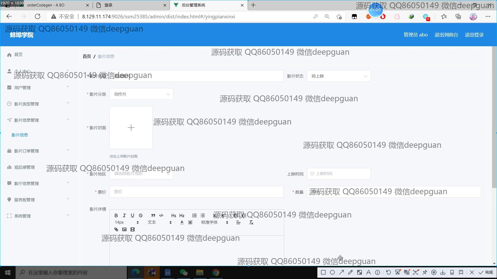
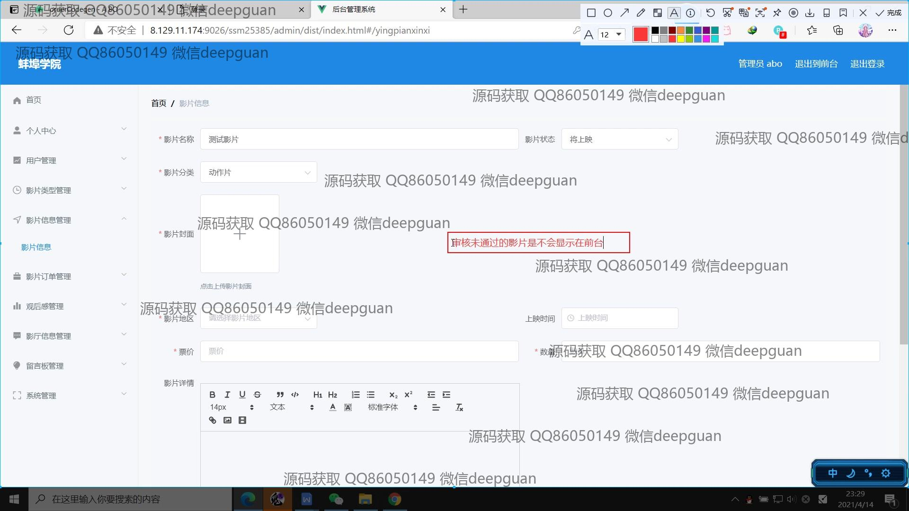
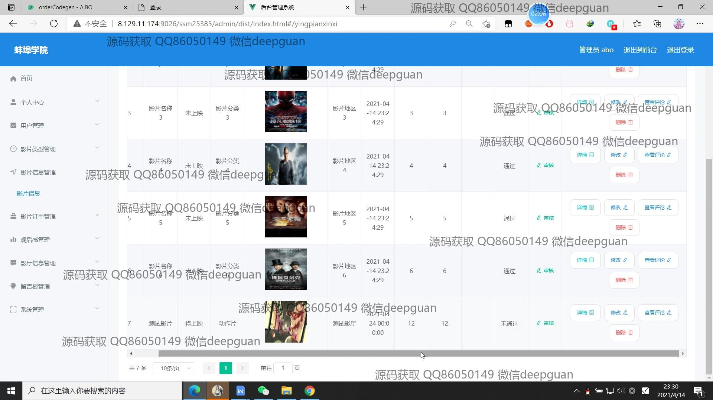
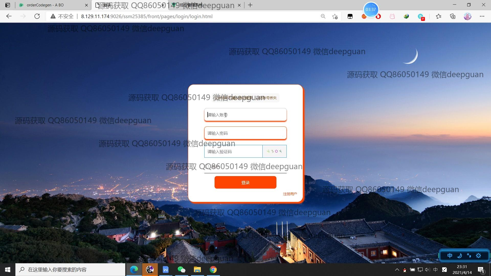
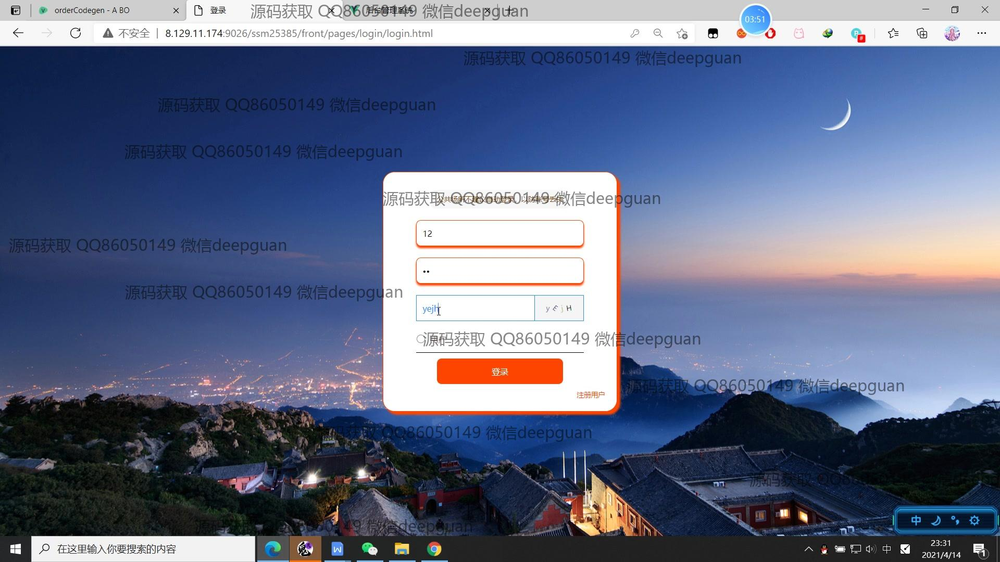
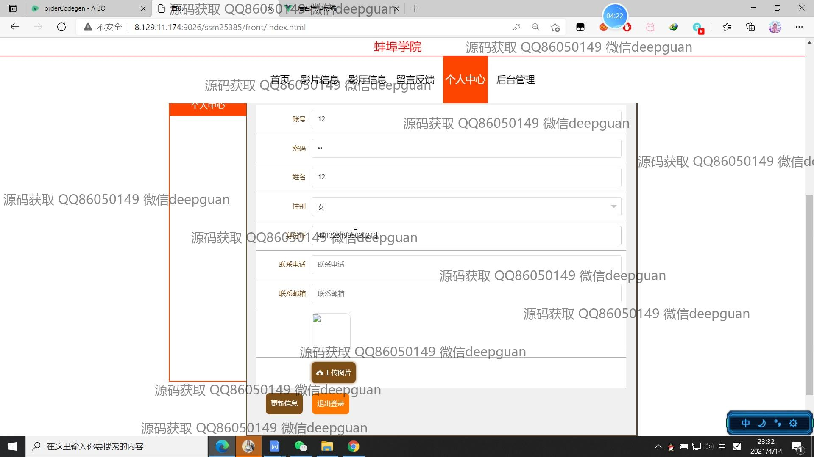
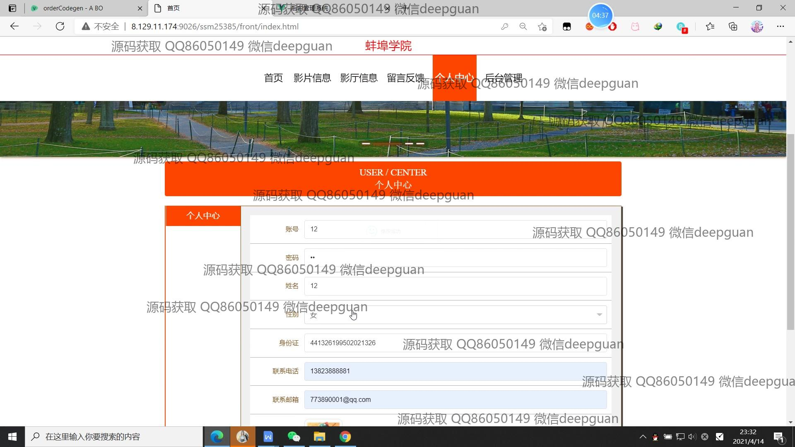
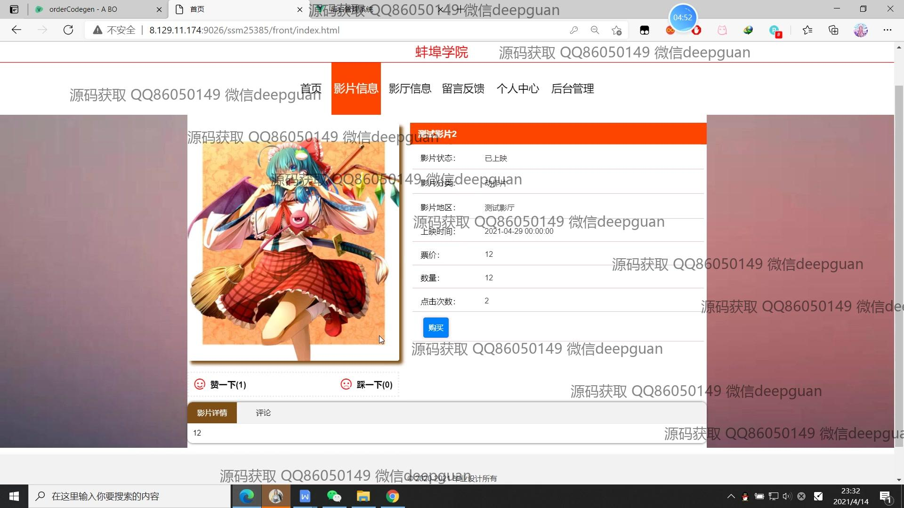
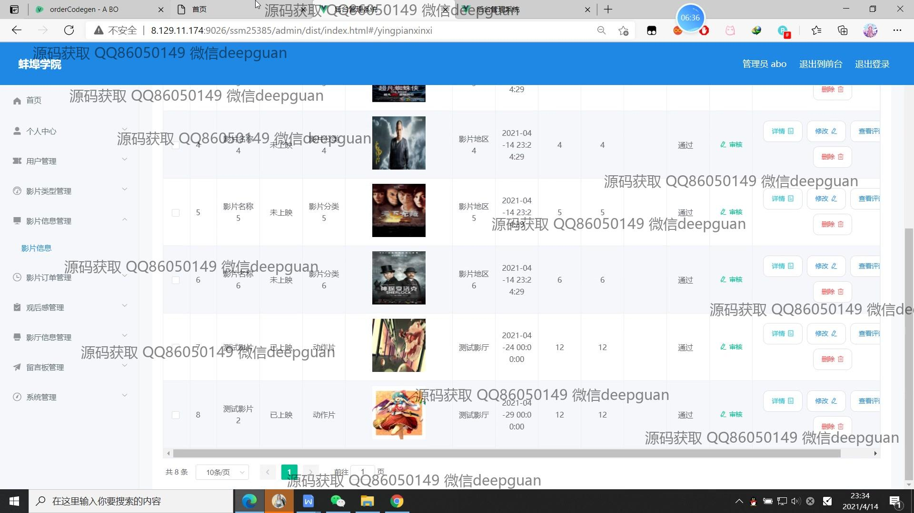

<h1 align="center">的电影院在线售票系统vue</h1>

## 简介
电影院在线售票系统：角色分为管理员、用户；功能包括用户管理、影片信息管理、订单管理、影厅管理、留言板管理，支持在线选票购票及个人信息管理，提高用户操作体验。    --计算机毕业设计源码；毕设源码；java毕业设计源码

## 联系方式

<h3 align="center">获取完整代码与数据库文件 + 微信：deepguan QQ: 86050149 QQ群: 783742310</h3>

<h3 align="center">可帮忙远程部署 包运行成功！提供远程部署、修改代码、设计文档指导、代码讲解等服务！</h3>

## 功能介绍（完整见运行截图）
管理员：   
基本功能：登录，注册，退出 系统管理：用户管理，影片类别管理，影片信息管理，订单管理，观众管理，影厅信息管理，留言板管理和系统设置 页面管理：个人中心，影片信息录入与修改，影片类型编辑，电影订单审核与管理，影厅信息编辑，留言与观后感回复控制 网站维护：轮播图管理，电影审批，影片评论查看与管理，数据审核通过或不通过   

用户：  
基本功能：登录，注册，退出 系统功能：查看首页信息，包括影片推荐及动态插画，浏览影片信息、影厅信息、订单详情等内容 交互体验：留言反馈，个人中心信息查看与修改，包括修改密码，查看及编辑观后评论 用户服务：浏览影片详情及评论，在线选票，查看及管理个人订单，增加收藏列表

## 运行截图

本代码来源于网络,仅供学习参考使用!

